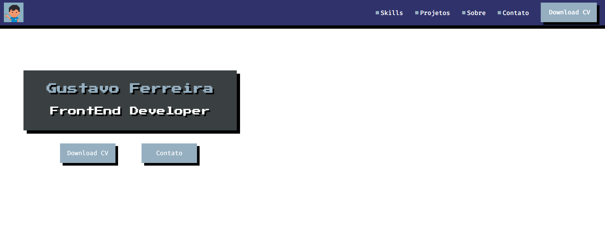

## 😄 Sobre mim

> + 🤔   Explorando novas tecnologias e desenvolvendo alguns projetos.
>
> + 🎓   Estudando Analise e desenvolvimento de Sistemas na <a href="http://fatecpp.edu.br">Fatec - Presidente Prudente</a>.
>
> + 💼   Procurando estágio para aplicar minhas habilidades.
>
> + 🌱   Aprendendo mais sobre JavaScript, ReactJS e Sass.

## 🚀  Minhas Skills

Aplicações

DevOps

Ferramentas de Desenvolvimento

## 🌎 Onde me encontrar?

<a href="https://www.linkedin.com/in/gustavo-ferreira-679719200/">Linkedin</a>

<a href="https://mail.google.com/mail/u/0/#inbox">gf070901@gmail.com</a>

  

## 💻 Em desenvolvimento

### Site pessoal

